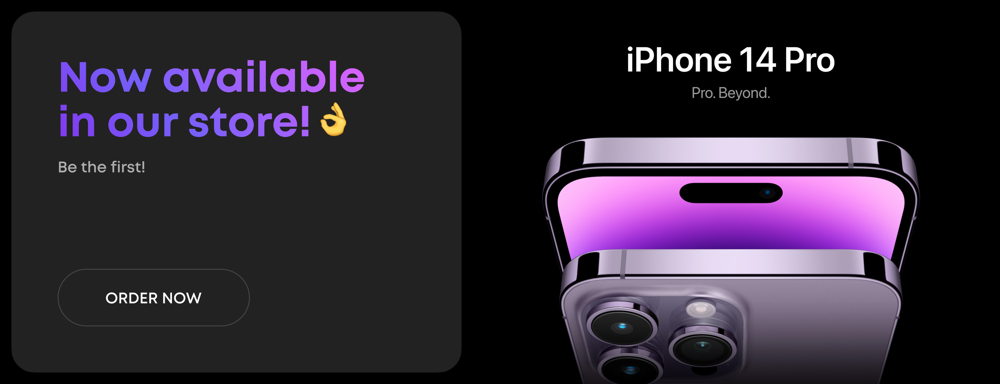

# Linx-Net 👌

A modern e-commerce platform for electronic devices focusing on phones, tablets, and accessories.



## Description

Linx-Net is a modern, user-friendly e-commerce web application built with React and TypeScript. The platform offers a seamless shopping experience for electronic devices, including mobile phones, tablets, and accessories.

## Features

- **Responsive Design**: Fully responsive interface that works across desktop, tablet, and mobile devices
- **Product Browsing**: Browse products by categories (phones, tablets, accessories)
- **Product Carousels**: View featured products in interactive carousels
- **Favorites**: Save products to favorites with a simple click
- **Shopping Cart**: Add products to cart for purchase

## Technology Stack

- **Frontend**: React, TypeScript
- **Styling**: Tailwind CSS
- **Routing**: React Router
- **State Management**: React Hooks
- **UI Components**: Custom components built from scratch
- **Icons**: SVG Sprites

## Project Structure

```
src/
├── app/          # App configuration and entry point
├── assets/       # Static assets including sprite.svg
├── pages/        # Page components
├── shared/       # Shared resources
│   ├── data/     # Mock data and data structures
│   ├── hooks/    # Custom React hooks
│   ├── styles/   # Global styles
│   └── ui/       # UI components
└── widgets/      # Larger feature components
    ├── Footer/   # Footer component
    ├── Header/   # Header navigation component
    └── HomeCarousel/ # Home page carousel
```

## Getting Started

### Prerequisites

- Node.js (v14.0.0 or higher)
- npm or yarn

### Installation

1. Clone the repository:

   ```
   git clone https://github.com/yourusername/Linx-Net.git
   cd Linx-Net
   ```

2. Install dependencies:

   ```
   npm install
   # or
   yarn install
   ```

3. Start the development server:

   ```
   npm run dev
   # or
   yarn dev
   ```

4. Open your browser and navigate to `http://localhost:3000` (or the port shown in your terminal)

## Build

To build the app for production:

```
npm run build
# or
yarn build
```

## Contributing

Contributions are welcome! Please feel free to submit a Pull Request.
